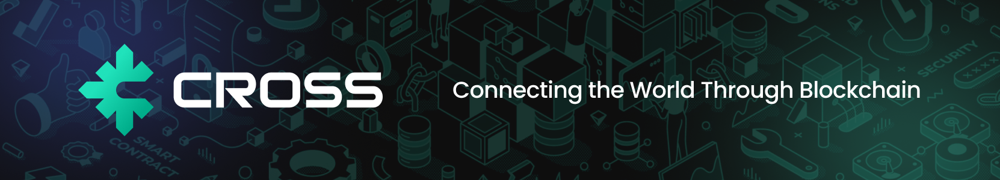

# Cross Token 🔗

**Cross Token** (`CROSS`) is an ERC20 token deployed on the **BNB Smart Chain (BSC) Mainnet**. It is the BSC-side representation of **ONE Coin**, the native coin of **ONEchain**, and together with the native coin it accounts for a single, fixed total supply across both networks.

> **A note on naming** — the chain and the bridge were rebranded to **ONEchain** and **ONEbridge**, and the native coin to **ONE Coin**. The BSC token keeps the name `Cross` and the symbol `CROSS`: both are set in the contract constructor and are immutable on-chain, so they cannot be renamed without redeploying. Expect to see `CROSS` in wallets and explorers.

## Overview 📖

Cross Token lets value move between **BSC** and **ONEchain** through **ONEbridge**. ONE Coin is the native coin of ONEchain, so its supply is established at the chain level rather than issued by this contract. Cross Token is the form that supply takes on BSC, giving the asset an ERC20 representation that BSC wallets, explorers, and contracts can work with.

## How It Works ⚙️

- **Bridge Mechanism**  
  ONEbridge operates on a **lock-and-transfer** basis. When moving value from BSC to ONEchain, Cross Tokens are locked on BSC and a corresponding amount of ONE Coin is **transferred** out of the bridge's reserve on ONEchain. Moving in the opposite direction reverses the flow. Because ONE Coin is a native coin, nothing is minted at any point in the process.

- **Fixed Total Supply**  
  The total supply of Cross Token is fixed at **1,000,000,000 CROSS**, and the contract exposes no minting function after deployment. Bridging moves value between the two representations of the asset and never creates new supply, so the total across BSC and ONEchain stays bounded by that figure.

- **Deployment on BSC**  
  Deploying on BNB Smart Chain puts the token on a widely supported, publicly auditable network. Balances, transfers, and the total supply can be independently verified on BscScan at any time.

## Benefits 💡

- **Controlled Issuance**  
  A fixed total supply with no post-deployment minting keeps issuance within a known limit.

- **Transparency and Security**  
  Every transfer is recorded on a public chain, and the contract is built entirely on audited OpenZeppelin components.

- **Seamless Cross-Chain Transfers**  
  ONEbridge moves value between BSC and ONEchain without asking users to manage the underlying mechanics.

## Token Details 🪙

All values below are read directly from the deployed contract.

| Field | Value |
|---|---|
| Network | BNB Smart Chain (BSC) Mainnet |
| Chain ID | `56` |
| Contract Address | `0x6bf62ca91e397B5A7d1D6bCe97D9092065d7A510` |
| Explorer | [BscScan](https://bscscan.com/token/0x6bf62ca91e397B5A7d1D6bCe97D9092065d7A510) |
| Name | `Cross` |
| Symbol | `CROSS` |
| Decimals | `18` |
| Total Supply | `1,000,000,000` CROSS |
| Owner | `0xd68E6D93305578c26243eE83Ec28E4a657Ec008b` |

## Smart Contract Information 📜

- **Source**: [`contracts/CrossToken.sol`](contracts/CrossToken.sol)
- **OpenZeppelin Contracts**: v5.1.0
- **Solidity Version**: v0.8.22+commit.4fc1097e
- **Optimizer Settings**:
  - Enabled: true
  - Runs: 200
- **Inherited Modules**:
  - `ERC20` — the standard fungible token interface
  - `ERC20Burnable` — burn support, with `burn(uint256)` **overridden to `onlyOwner`** so that only the owner can reduce supply
  - `ERC20Permit` — gasless approvals by signature ([EIP-2612](https://eips.ethereum.org/EIPS/eip-2612))
  - `Ownable` — single-owner access control, assigned to `initialOwner` at deployment
- **Constructor**: `constructor(address initialOwner, uint256 initialSupply)` mints `initialSupply * 10 ** decimals()` to `initialOwner`. This is the only mint in the contract; no further minting is possible.

## Audit Report 🛡️

The CROSS project has undergone a security audit by **CertiK**. You can view the detailed audit report via the link below:

- [CertiK Skynet - CROSS](https://skynet.certik.com/projects/cross)

## Usage 🔧

Requires Node.js and npm.

```bash
# install dependencies
npm install

# compile contracts and generate TypeChain types
npx hardhat compile

# run the test suite
npx hardhat test
```

## Deployment 📦

Deployment is handled by [`scripts/deploy.ts`](scripts/deploy.ts). Copy `.env.example` to `.env` and fill in:

| Variable | Purpose |
|---|---|
| `INITIAL_OWNER_ADDRESS` | Address that receives the initial supply and becomes the contract owner |
| `INITIAL_SUPPLY` | Initial supply in whole tokens — the contract scales it by `10 ** decimals()` |

Then run the script against a network defined in [`hardhat.config.ts`](hardhat.config.ts), supplying that network's node URL and deployer key:

```bash
npx hardhat run scripts/deploy.ts --network <network>
```

The script prints the deployed address along with the resulting `owner`, `name`, `symbol`, `decimals`, and `totalSupply` so the deployment can be verified immediately.

## Future Enhancements 🚀

We are continuously working to enhance the cross-chain experience. Future improvements may include:

- Advanced cross-chain interoperability features
- Additional security audits and optimizations
- Enhanced user interfaces for managing cross-chain transfers

## Conclusion ✅

Cross Token is a key component of our multi-chain strategy. By giving ONE Coin a verifiable ERC20 representation on BNB Smart Chain and moving value through ONEbridge without minting, we keep the total supply of the asset fixed and independently auditable across both networks.

For more detailed documentation, see the [ONE Docs](https://docs.onechain.nexus) or contact the team for further information.

---

Feel free to contribute or open an issue if you have any suggestions or questions! 🤝
